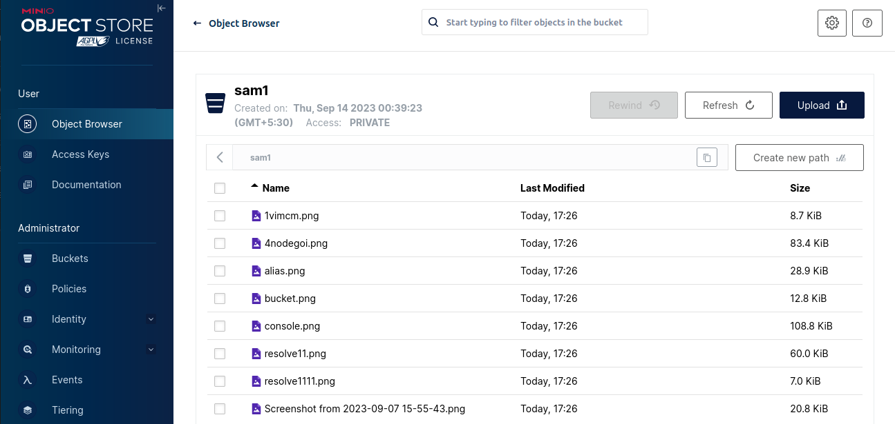

#  <p style="text-align: center;">Setup MinIO</p>
  
  
##  Task Requirement
  
To set up an object storage system in a cluster using MinIO.
  
##  Environment Details
  
- **Operating System (OS):** Ubuntu 20.04
- **CPU:** 4
- **Storage:** 8 GB
  
##  List of Tools and Technologies
  
- **MinIO** - Latest Version (RELEASE.2023-08-16T20-17-30Z)
- **Docker** - Version 24.0.6
- **Sidekick**
  
##  Definitions of Tools
  
- **MinIO**: MinIO is a software-defined high-performance distributed object storage server. It can run on consumer or enterprise-grade hardware and supports various operating systems and architectures.
- **Docker**: Docker is a containerization platform that provides a consistent environment for running applications, making it easy to move and deploy applications across different systems.
- **Sidekick**: Sidekick is a high-performance sidecar load-balancer that eliminates centralized load balancer bottlenecks and simplifies DNS failover management by attaching a tiny load balancer to client application processes.
  
##  Commands for Setup or Configuration

### 1. Install Docker on Linux:
 #### Update Package Lists:
 **Step 1**
 
 ```
 sudo apt update
```

 `sudo:` This stands for "Superuser Do" and it's used to execute commands with elevated privileges. It allows you to make changes to your system that regular users wouldn't have permission to do.

 `apt:` This is the package manager for Debian-based systems. It's used for handling packages—installing, updating, and removing them.

 `update:` This is a specific command for apt. When you run sudo apt update, it doesn't actually update the packages on your system; instead, it updates the local database of available packages. This database is necessary for the package manager to know what packages are available, where to download them, and what versions exist.
  
  **Step 2**
 
 sudo apt install apt-transport-https ca-certificates curl software-properties-common

**Step 3**
```
curl -fsSL https://download.docker.com/linux/ubuntu/gpg | sudo apt-key add -
```

**Step 4**
```
sudo add-apt-repository "deb [arch=amd64] https://download.docker.com/linux/ubuntu focal stable"
```

**Step 5**
```
apt-cache policy docker-ce
```

**Step 6**
```
sudo apt install docker-ce
```

### 2. Install Docker Compose:
#### Download Docker Compose:
```
sudo curl -L "https://github.com/docker/compose/releases/latest/download/docker-compose-$(uname -s)-$(uname -m)" -o /usr/local/bin/docker-compose
```

#### Make Docker Compose Executable:
```
sudo chmod +x /usr/local/bin/docker-compose
```

#### Verify Docker Compose Installation:
```
docker-compose --version
```

  
###  3. Edit the `docker-compose.yml` File
  
  
   Use the `vim` command to open and edit the `docker-compose.yml` file, which is commonly used for defining multi-container Docker applications.
  
  
```
vim docker-compose.yml
```
  
Here's a breakdown of what this command does:
  
- **`vim`**: This is the command to launch the Vim text editor.
- **`docker-compose.yml`**: This is the filename you want to open and edit. In this case, it appears to be a Docker Compose configuration file, which is commonly used for defining multi-container Docker applications.
  
Once you run this command, Vim will open the `docker-compose.yml` file, allowing you to view and make changes to its contents. Vim has its own set of commands and shortcuts for navigating and editing text. If you're not familiar with Vim, here are some basic commands to get you started:
  
- Press i to enter insert mode, where you can edit the file.
- Use the arrow keys to navigate to the desired location in the file.
- Press Esc to exit insert mode and return to command mode.
- To save your changes, press : to enter command mode, then type w to write (save) the file and q to quit Vim. You can combine these commands as :wq to save and exit.
  

  
###  4. Add the Following Script to docker-compose.yml:
  
  
```
version: '3'
services:
  lb:
	image: minio/sidekick:v0.5.1
	ports:
  	- 8080:8080
	command:
  	- --health-path=/minio/health/ready
  	- http://minio{1...4}:9000
  minio1:
	image: minio/minio:RELEASE.2023-08-16T20-17-30Z
	environment:
  	MINIO_ACCESS_KEY: admin
  	MINIO_SECRET_KEY: redhat1234
	command: server http://minio{1...4}/data
  minio2:
	image: minio/minio:RELEASE.2023-08-16T20-17-30Z
	environment:
  	MINIO_ACCESS_KEY: admin
  	MINIO_SECRET_KEY: redhat1234
	command: server http://minio{1...4}/data
  minio3:
	image: minio/minio:RELEASE.2023-08-16T20-17-30Z
	environment:
  	MINIO_ACCESS_KEY: admin
  	MINIO_SECRET_KEY: redhat1234
	command: server http://minio{1...4}/data
  minio4:
	image: minio/minio:RELEASE.2023-08-16T20-17-30Z
	environment:
  	MINIO_ACCESS_KEY: admin
  	MINIO_SECRET_KEY: redhat1234
	command: server http://minio{1...4}/data
  
```

  
###  5. Start Docker Containers in Detached Mode
  
  
```
docker-compose up -d
```
  
The command docker-compose up -d is used to start Docker containers defined in a Docker Compose file in detached mode. Let me break down the command for you:
- **`docker-compose`**: This is the command-line tool for Docker Compose, which is a tool for defining and running multi-container Docker applications.
- **`up`**: This subcommand is used to start the containers defined in the Docker Compose file.
- **`-d` or `--detach`**: This flag tells Docker Compose to run the containers in the background, detached from the terminal. This means that you can continue to use the terminal for other tasks without the container logs and output being displayed in your terminal window. The -d flag is optional, but it's commonly used for long-running services.
  
When you run docker-compose up -d, Docker Compose will read the docker-compose.yml file in the current directory (or you can specify a different Compose file with the -f flag), create and start the containers defined in the Compose file, and detach them from the terminal. This is useful for running services or applications that should continue to run in the background.
  
Here's a basic example of how you might use this command:
  
1. Navigate to the directory containing your docker-compose.yml file.
  
2. Run docker-compose up -d.
  
**Output:**
  

  
###  6. Edit the /etc/hosts File
  
  
```
vim /etc/hosts
```
  
The command vim /etc/hosts is used to open the /etc/hosts file in the Vim text editor. This file is typically found on Unix-like operating systems, including Linux. The /etc/hosts file is used to map hostnames to IP addresses and is often used for local DNS resolution.
  
Here's a breakdown of the command:
  
**`vim`**: This is the command to start the Vim text editor.
**`/etc/hosts`**: This is the file path. It specifies the location of the file you want to open. In this case, you are opening the /etc/hosts file, which is commonly used to define static IP address-to-hostname mappings and hostname resolutions.
  
When you run this command, Vim will open the /etc/hosts file, allowing you to view and edit its contents. Vim is a powerful and customizable text editor, so you can use it to make changes to the file and save those changes if needed.
  
**Output:**
  

  
###  7. Install the MinIO Client
  
  
The MinIO Client allows you to work with your MinIO server from the command line.
  
Install the mc command line tool onto the host machine. Click the tab that corresponds to the host machine operating system or environment:
  
The following commands add a temporary extension to your system PATH for running the mc utility. Defer to your operating system instructions for making permanent modifications to your system PATH.
  
Alternatively, execute mc by navigating to the parent folder and running ./mc --help
  
```
curl https://dl.min.io/client/mc/release/linux-amd64/mc \
  --create-dirs \
  -o $HOME/minio-binaries/mc
```

```
chmod +x $HOME/minio-binaries/mc
```
  
```
export PATH=$PATH:$HOME/minio-binaries/
```
  
```
  mc --help
```
  
**Output:**
  

  
###  8. Configure a MinIO Alias
  
  
```
mc alias set myminio http://127.0.0.1:8080 admin redhat1234
```
  
The command you've provided appears to be related to configuring an alias for MinIO, a popular object storage server. This alias is being set using the mc command-line tool. Let me break down the command for you:
  
**`mc`**: This is the command-line tool used for interacting with MinIO servers.
**`alias set`**: This part of the command is used to set up an alias for a MinIO server, allowing you to refer to it by a more convenient name.
**`myminio`**: This is the alias you are setting for the MinIO server. You can choose any name you like as long as it's unique and helps you identify the server.
**`http://127.0.0.1:8080`**: This is the URL of the MinIO server you are configuring. In this case, it's set to a local address, which means you are configuring an alias for a MinIO server running on your local machine at port 8080. You would replace this with the actual URL of your MinIO server if it's hosted elsewhere.
**`admin`**: This is the access key or username used to authenticate with the MinIO server.
**`redhat1234`**: This is the corresponding secret key or password used to authenticate with the MinIO server. Make sure to keep this key secure.
  
**Output:** 
  

  
7. Get Information About the MinIO Server
  
```
mc admin info myminio
```
  
  
The command `mc admin info myminio` is used with the `mc` (MinIO Client) tool to retrieve information about a MinIO server instance named "myminio." MinIO is an open-source, high-performance object storage system that can be used for storing and managing large amounts of data.
  
Here's a breakdown of the command:
  
**`mc`**: This is the MinIO Client command-line tool used for interacting with MinIO servers.
admin: This is a subcommand of mc used for performing administrative tasks on a MinIO server.
**`info`**: This is a specific action performed by the admin subcommand. It is used to retrieve various information and statistics about the MinIO server.
**`myminio`**: This is the alias or configuration name for the MinIO server you want to get information about. The name "myminio" should correspond to a server configuration you've previously set up using the mc config host add command.
  
When you run `mc admin info myminio`, the MinIO Client will connect to the MinIO server specified by the "myminio" alias and retrieve information such as server version, configuration settings, and statistics about buckets and objects. The exact information displayed may vary depending on the version of MinIO and the server's configuration.
  
Please make sure that you have the MinIO Client (`mc`) properly configured with the necessary access credentials and server information before running this command.
  
  
**Output:**
  

  
###  9. Execute a Command Inside a Docker Container
  
  
  ```
  docker exec -it root_lb_1 "/sidekick" -a :8989 --health-path=/minio/health/ready http://minio{1...4}:9000
```
  
The command you provided appears to be a Docker command using the docker exec command to run a command inside a Docker container. Let's break down the command:
  
1. **`docker exec`**: This is the Docker command used to execute a command inside a running Docker container.
2. **`-it`**: These are options for the docker exec command:
  - -i: Keep STDIN open even if not attached.
  - -t: Allocate a pseudo-TTY.
3. These options allow you to interact with the command being executed inside the container.
4. **`root_lb_1`**: This is the name or ID of the Docker container in which you want to execute the command. In this case, the container is named "root_lb_1."
5. **`"/sidekick"`**: This is the command that you want to run inside the specified container. It appears to be running the "/sidekick" executable or script inside the container.
6. **`-a :8989`**: This part of the command specifies an option for the "/sidekick" command being executed inside the container. It sets the address to ":8989."
7. **`--health-path=/minio/health/ready`**: Another option for the "/sidekick" command, it specifies the health check path as "/minio/health/ready."
8. **`http://minio{1...4}:9000`**: This is part of the command passed as an argument to "/sidekick." It appears to be a list of URLs, generated using brace expansion (from minio1 to minio4), which point to different Minio servers on port 9000.
  
In summary, this Docker command runs the "/sidekick" command inside the "root_lb_1" container, configuring it to use the address ":8989" and specifying a health check path. The "/sidekick" command appears to be designed to interact with multiple Minio servers (minio1 to minio4) on port 9000, possibly for some kind of load balancing or health checking operation.
  
**Output:**
  

  
###  10. View Docker Container Logs in Real-Time
  
```  
docker logs -f samarth_minio2_1
```
  
The `docker logs -f` command is used to view the logs of a Docker container in real-time. Here's a breakdown of the command you provided:
  
- **`docker`**: This is the command-line tool for managing Docker containers.
- **`logs`**: This is the subcommand that tells Docker you want to view the logs of a container.
- **`-f or --follow`**: This flag tells Docker to follow the log output in real-time, similar to the tail -f command in Unix-like systems.
  
After the -f flag, you have the name of the Docker container you want to view logs for, in this case, samarth_minio2_1. This is typically the name of a running Docker container.
  
So, when you run docker logs -f samarth_minio2_1, you'll see the logs from the samarth_minio2_1 container as they are generated in real-time. This can be useful for debugging, monitoring, or troubleshooting Docker containers. To exit from viewing the logs, you can usually press Ctrl+C.
  
**Output:**


  
###  11. Open a Web Page
  
  
Open the following link in your browser: http://172.19.0.5:39151
  
**Output:**


  
###  12. Open metrics 
  
  
All Nodes are shown in the below screenshot.
  

  
###  13. Create a New Empty File
  
  
Use the touch command to create a new empty file named "samarth.txt."
  
touch samarth.txt
  

  
###  14. Create a MinIO Bucket
  
Use the `mc mb` command to create a new MinIO bucket. 
  
Example:
  
```
mc mb myminio/sam1
```
  
The command `mc mb myminio/sam1` is used with the MinIO Client (mc) tool to create a new bucket named "sam1" in the MinIO server configured with the alias "myminio."
  
Here's a breakdown of the command:
  
- **`mc`**: This is the MinIO Client command-line tool.
- **`mb`**: This is a subcommand of mc used for creating a new bucket.
- **`myminio`**: This is the alias or configuration name for the MinIO server you want to interact with.
- **`sam1`**: This is the name of the bucket you want to create.
  
When you run this command, it will create a new bucket named "sam1" in the MinIO server configured with the alias "myminio." Buckets in MinIO are used to organise and store objects (files or data).
  
  
**Output:**
  

  
###  15.The object to copy from bucket
  
  ```
  mc cp /home/samarth/screenshots/sr.png -/myminio/sam1
```
  
The command you've provided appears to be using mc, which stands for MinIO Client. MinIO is an open-source, object storage server, and mc is a command-line tool for interacting with MinIO servers.
  
Here's a breakdown of the command:
  
**`mc`**: This is the MinIO Client command-line tool.
  
**`cp`**: This is the command to copy files or objects.
**`/home/samarth/screenshots/sr.png`**: This is the source file or object that you want to copy. It's located in the /home/samarth/screenshots/ directory and is named sr.png.
**`-/myminio/sam1`**: This is the destination where you want to copy the source file or object. It appears to be specifying a MinIO server named myminio and a bucket or directory within that server named sam1.
  

  
###  16.All Images are shown in the below screenshot 
  
  
```
mc ls myminio/sam1
```
  
The command mc ls myminio/sam1 is used with the MinIO Client (mc) to list the objects or files within the sam1 bucket or directory on the MinIO server named myminio.
  
When you run this command, it will list the objects/files in the specified MinIO bucket, displaying their names, sizes, and other relevant information.
  
Here's a breakdown of the command:
  
**`mc`**: The MinIO Client command-line tool.
**`ls`**: The subcommand to list objects or files.
myminio/sam1: The path to the bucket or directory on the MinIO server where you want to list objects.
  
  
**Output:**


  
**MinIO bucket Output:**
  

  
###  Reference Link
  
  
For more details, you can refer to this [GitHub link](https://github.com/karlpokus/minio-lab/blob/master/docker/distr-mode-lb.yml ).
  
